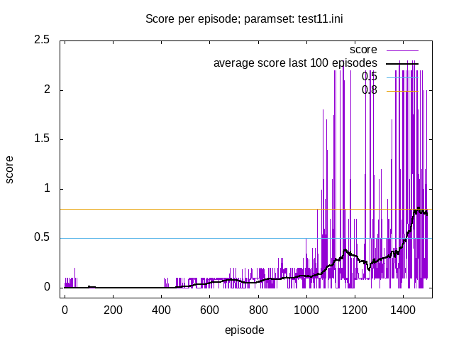
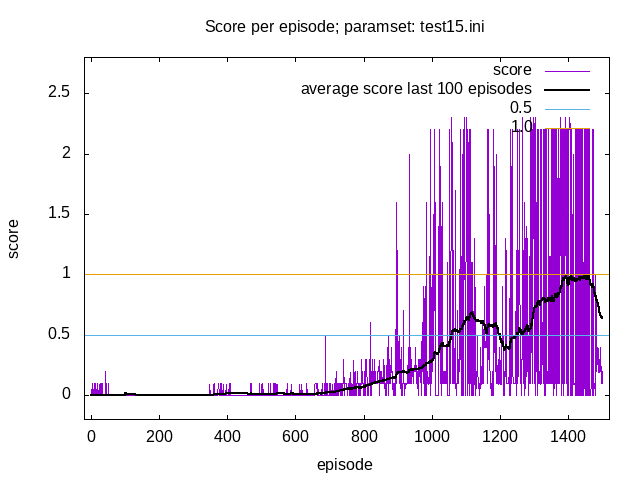

# Introduction
This project is going to be my (Matthias Schinacher) solution to a homework assignment for Udacity's Deep Reinforcement Learning Nano Degree.  
It contains mainly a python implementation of the DDPG- learning algorithm with replay-memory,
and a variation of priority replay. The actor and critic functions (normal
and target) of the DDPG are neural networks implemented with pytorch.

## [UPDATE 2019-01-06]
After the project already had been accepted and reviewed, I actually did by
coincedence find a bug in the critic network layout. The critic yielded two
values instead of one, probably due to a cut and paste error, when I used the
actor- network as a blueprint somehow. The algorithm still did work correctly,
since only the first value was actually used, but I consider it a bug none the less.

I fixed the bug and ran another simulation with almost identical parameters
as the winning "test11" configuration, the "test15" parameterset.
It also shows the desired learning.

# Project Details
The environment ist very similar to/ a variant of the "Tennis"
environment from Unity; [Unity ML-Agents GitHub](https://github.com/Unity-Technologies/ml-agents/blob/master/docs/Learning-Environment-Examples.md#Tennis).

In the environment two agents play a form of tennis, each agent is a racket
that con move towards the net (or opposite direction) and up and down.
They are tasked to keep the ball in play as long as possible.

Each agent receives a reward of 0.1 for each timestep where it manages to
play the ball across the net, and a reward of -0.01 when it lets the ball
drop to the floor or shoots it out of the court.

The environment can be accessed via python/ has a python interface.
The state space is a vector of 24 numeric values (that represent the agents velocity,
location and so on) per agent, the action space has two continuous values per
agent.

The defined goal of the homework/ project is/was to achieve a "sustained" score of at least 0.5 per episode.
That means, that the algorithm/ the model should be able to average above score 0.5 for "the last 100 episodes"
over a number of episodes. The score for each episode is the maximum score of
the 2 agents.

# Dependencies
The actual "program" (agent) is a python script that can be run from the command line.
To be able to run it, python 3.6 must be installed.

## Python packages
The following packages/ libraries are needed

- numpy, at least version 1.11.0
- torch, version 0.4.0 (pytorch)

## Other dependecies
A minimal install of OpenAI gym is required, as well as the classic control environment group
and the box2d environment group; instructions how to install this [can be found here](https://github.com/openai/gym).

Additionally one needs the "Tennis" environment from udacity, which was created for the course.
This can be downloaded [for Linux](https://s3-us-west-1.amazonaws.com/udacity-drlnd/P3/Tennis/Tennis_Linux.zip)
(and other operating systems).

# Running the script/ program/ agent
To run the script from the command line (Linux), the dependencies mentioned must be installed and the contents
of the "Tennis_Linux.zip" need to be unzipped in the same directory, where the actual script "ms_drlnd_collab_comp.py"
resides, so that we have a subdirectory "Tennis_Linux".

    python ms_drlnd_collab_comp.py command-file.ini

will start the agent as per the parameters in the file "command-file.ini".
Depending on the contents of the command-file, the agent will try to solve the environment and train 
the neural networks that approximate the actor and critic functions of the DDPG
algorithm used. 
The script can load predefined NN- models from a files and only simulate
the Tennis- environment without learning. For more details see also the project- report.

## Parameters
- global
    - runlog: name of the logfile to use
- mode
    - train: whether we're in training mode
    - show: flag, whether to show  the simulation in "human time"
- rand
    - seed: seed for  random number generation
- model
    - h1: first size- parameter for the actor- NN- model
    - h2: second size- parameter for the actor-NN- model
    - c_h1: first size- parameter for the critic- NN- model
    - c_h2: second size- parameter for the critic-NN- model
    - batch_norm: whether to use batch norm layers (flag)*
    - load_file: name- fragment for the files from which to load models (if any)
    - save_file: name- fragment for the files to save the models to
- hyperparameters
    - episodes: number of episodes to run:
    - max_steps: maximum number of time-steps to play per episode
    - warmup_episodes: epiosodes to run with pure random sampling
    - warmup_episodes_f: scale factor for pure random sampling
    - replay_buffersize: size of the replay memory
    - replay_batchsize: number of transitions to sample per optimizing step
    - replay_steps: simulation-steps between  each optimization run
    - optimizer_steps: no. of batch optimization-steps  per optimization run
    - learning_rate: the learning rate for the actor optimizer
    - learning_rate_c: the learning rate for the critic optimizer
    - gamma: DPPG gamma factor
    - grad_norm_clip: grad-norm clipping treshold for the critic (smaller 0.0 means no clipping)
    - prio_replay:  whether to use priority replay (flag)
    - prio_offset: offset- parameter for the priority replay, if used
    - tau: tau (soft target update)    - sample action noise
        - epsilon_start: start value for epsilon
        - epsilon_delta: value to subtract from epsilo  for each optimization step
        - epsilon_min: minimum/ final value for epsilon
        - noise_theta: theta for noise process
        - noise_sigma: sigma for noise process

*: note that the "batch_norm"- parameter, though present in the script, is currently
not usable, as batch-norm is not working (in the moment). I'll fix this,
when I find time, but it was not neccessary for this project.

### Example command-file contents

    [global]
    runlog = test10.log
    
    [mode]
    train = True
    show = False
    
    [rand]
    seed = 14941
    
    [model]
    save_file  = test10
    model_h1   = 311
    model_h2   = 177
    model_c_h1 = 309
    model_c_h2 = 179
    batch_norm = False
    
    [hyperparameters]
    episodes          = 1500
    warmup_episodes   = 50
    warmup_episodes_f = 0.4
    replay_buffersize = 10000
    replay_batchsize  = 512
    replay_steps      = 1
    gamma             = 0.99
    learning_rate     = 0.0002
    learning_rate_c   = 0.002
    optimizer_steps   = 1
    tau               = 0.01
    max_steps         = 500
    
    epsilon_start     = 2.5
    epsilon_delta     = 0.004
    epsilon_min       = 0.02
    noise_theta       = 0.15
    noise_sigma       = 0.2
    
    prio_replay       = True
    prio_offset       = 0.1
    grad_norm_clip    = 5.0

## Output
### Logfile
The main output is a log file which contains various information as within #- style comment lines
and the time-series data of
- Episode- number
- Score (at episode end)
  Average Score from the last 100 episodes
  Steps played for the episode/ episode length in steps
- Size of replay buffer at episode end
- The epsilon at episode end

Example:

    # Episode Score average(last-100-Scores) Steps RMSize Epsilon
    1 0.0 0.0 14 0.0 403 -
    2 0.0 0.0 15 0.0 832 -
    ...
    103 0.0 0.007800000142306089 14 3230 2.1909999999999883
    104 0.0 0.007800000142306089 14 3258 2.187999999999988
    105 0.0 0.007800000142306089 14 3286 2.184999999999988
    106 0.0 0.007800000142306089 15 3316 2.181999999999988
    ...

# The solution
I did need to experiment quite a bit with different sets of model sizes
and hyper-parameters until I found a combination that solved the project.

## Graph
The "best" yet simulation run was the "test11" one, as can be seen in:

One should be able to replicate the result by running:

    python ms_drlnd_collab_comp.py test11.ini

It did reach score 0.5 over the last 100 episodes at episode 1413
and actually reached 0.8 (avrg. last 100).  
See the actual project report for details.

## Video
The file "test11s.webm" contains about 30 seconds of video showing the model
from "test11" playing. This should be reproducable by:

    python ms_drlnd_collab_comp.py test11s.ini

("s" for show, models must be unzipped in the same directory)

(I'm trying to embed the video here, but I fear github is not showing this. Why?)  
<video src="test11s.webm" poster="video_test11s.png" width="600" controls preload></video>

# [UPDATE 2019-01-06]
Result of parameterset "test15" (command-file "test15.ini"); simulation run after
bugfix for critic network layout.

# Misc
## Additional remarks
The solution I found was DDPG where both agents used the same actor and critic
with a joined replay buffer. I experimented with a version, where the networks
were seperate (each agent had it's own critics and actors and a seperate
replay buffer), but this version never reached a sustained 0.5 score;  
see script "ms_drlnd_collab_comp_sep.py".

## ZIP- archives
### INI.zip
Command files for the simulation runs.

### LOGS.zip
Log outputs of the simulation runs.

### GRAPHS.zip
Pictures created with gnuplot from the log-files and used for the project report.

### MODELS.zip
The NN- models resulting from the simulation runs.  

NOTE: the models are usually the models/ networks at the end of a simulation- run.
Thus they are not neccessarily the "best" models of that run, they do not represent
the state of the networks, when the actor was on top of it's ability to compute
good actions.  
Except for the simulation-runs that did solve the task; for these, additional
models were saved; more precisly the models at the end of the episode with the
highest score after the task was solved (avrg. 0.5 for last 100) are saved with
the additional "_max"- indicator in names.

## See also
* report.pdf: the project report, contains additional information
